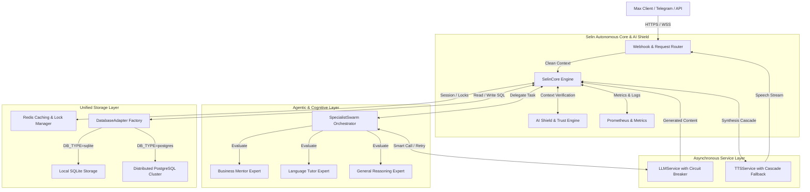

# Selin AI Architectural Blueprint & System Specifications

This document outlines the professional system architecture, design patterns, data flow, intellectual property protection boundaries, and security measures of the **Selin AI** cognitive platform.

---

## 1. High-Level Architecture Flow

The system is designed as a modular micro-kernel architecture with asynchronous adapters, multi-agent orchestrators, and a dual-storage persistence layer.



---

## 2. Core Kernel Isolation & IP Protection (Core-Adapter Decoupling)

A key architectural advantage and intellectual property (IP) protection barrier of Selin AI is the absolute isolation of its cognitive and business kernel from external messengers or communication APIs.

* **Adapter Design Pattern:** The communication gateway (e.g., `MaxAdapter`) is treated as a pluggable, peripheral driver. It implements the serialization of messenger payloads into generic internal transport structures (`MessageContext`) and returns responses.
* **Rapid Multi-Platform Deployment:** Because **SelinCore**, the **SpecialistSwarm**, and the underlying persistence layers contain zero dependencies on the proprietary communication protocols of any specific messenger:
  * Adding integration for **Telegram**, **WhatsApp**, **Slack**, or a **Custom Web Widget** requires only implementing a lightweight adapter class (typically under 100 lines of code).
  * The transition can be executed seamlessly in **less than 1 day** without modifying a single line of the cognitive routing, memory, or business logic.

---

## 3. Modular System Breakdown

### 3.1 SelinCore Engine (State & Flow Coordinator)
The central orchestrator of the platform. It intercepts user interactions, initiates transaction locks via Redis to prevent race conditions during rapid tapping, recovers state from the database, and routes inputs sequentially through safety layers, the swarm, and formatting controllers.

### 3.2 SpecialistSwarm (Multi-Agent Routing)
Instead of relying on a single monolith LLM prompt, incoming queries are classified and processed by dedicated domain experts:
* **Business Mentor Expert:** Optimized for strategic task planning, streak tracking, and financial analysis.
* **Language Tutor Expert:** Standardized with an Leitner system database backend for smart vocabulary practice, lessons, and reviews.
* **General Reasoning Expert:** Processes open-ended natural language requests.

### 3.3 LLMService (With Autonomous Circuit Breaker)
Acts as a proxy for the Gemini API. To ensure absolute production uptime:
* Integrates a custom **Circuit Breaker** and progressive retry intervals.
* Tracks failure ratios, dynamically falling back to alternative model configurations or cached responses if primary model response rates spike.

### 3.4 TTSService (With Cascade Fallback)
Maintains absolute reliability of voice processing pipelines:
* Uses a hierarchical cascade: attempts high-fidelity server-side neural synthesis first, automatically degrading to lightweight on-device speech alternatives if latency budgets are violated.
* Cache layers reuse raw audio assets via SHA-256 hashes of text segments to minimize computation and billing.

---

## 4. Security Framework (Trust and Safety)

```
[ Incoming Payload ] ──> [ Decryption / Auth ] ──> [ AI Shield Protection ] ──> [ PII Masking ] ──> [ Swarm Engine ]
```

* **AI Shield Engine:** Intercepts raw prompts using a pre-configured vector-based classifier and strict token patterns to halt **Prompt Injection**, **Jailbreak payloads**, and malicious override sequences before reaching the LLM layer.
* **Trust Engine & Rate Limiter:** Continuously monitors API request frequencies. Implements custom progressive cooling blocks per user identity to mitigate automated DDoS-like abuse on LLM APIs.
* **PII Masking:** Sanitizes input vectors to mask user-identifiable data (e.g., telephone numbers, private credit cards) with transient placeholders before proxying to third-party APIs.

---

## 5. Scalability & Database Agnosticism

### 5.1 DatabaseAdapter Factory
To support rapid horizontal scaling, Selin AI utilizes a strict agnosticism layer driven by the `DatabaseAdapter` interface:
* **SqliteAdapter (Default Development):** Standard, transactional, local file storage requiring no external setups.
* **PostgresAdapter (High-Performance Production):** Automatically loaded if `DB_TYPE=postgres`. Converts SQL parameter query configurations (SQLite style `?` to PostgreSQL style `$1, $2, $3...`) dynamically on the fly, allowing zero-change migration of all core schemas.

### 5.2 Enterprise Scaling Architecture
* **State & Cache Isolation:** All non-persistent context, LLM answer states, and locks reside in a distributed **Redis** database, allowing stateless container instances to spin up/down elastically behind an Nginx or Cloud Run load balancer.
* **Stateless Docker Deployments:** Built around lean Node.js processes, enabling sub-second horizontal replication on container platforms (AWS ECS, Google Cloud Run, Kubernetes).

---

## 6. Uptime, Telemetry & Diagnostics

The system exposes metrics for industry-standard monitoring tooling to ensure 99.99% service availability:
* **Prometheus Metrics Engine:** Exposes real-time endpoints tracking API execution delays, model token volumes, error rates, and active user session totals.
* **A/B Testing Telemetry:** Emits dedicated metric dimensions (`selin_prompt_variant_selected`) to track variant usage rates and determine conversions with mathematical precision.
* **Health Check Gateways:** Dedicated `/api/health` diagnostics checking database performance, memory allocations, and Redis latency.
